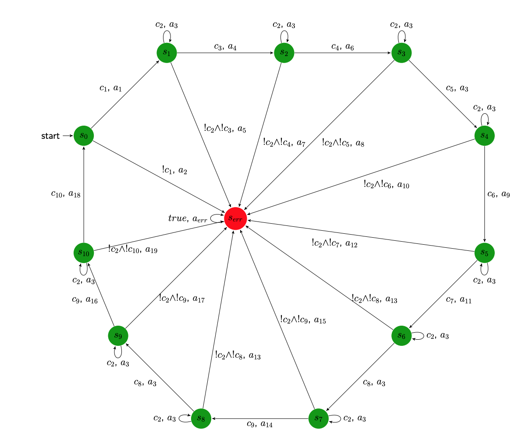

# FST
This is a generic Finite State Transducer written in C++.

# Usage:
1) Hash include the FST.h file in main.cpp
2) Make a node vector containing all of your nodes
3) For each node define its transitions i.e edges, you can optionally name the nodes.
4) Each edge has condtions and actions which are defined in the TransitionsConditions.h file
5) Make sure to pass in your input data to the FST object 
6) Run fst.simulate(n) where n is a integer number of steps

